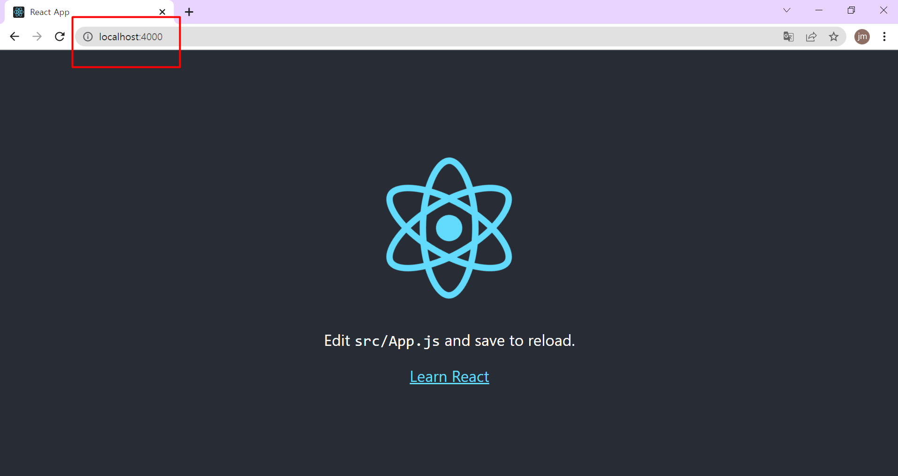

# 📚 React_Mission
🦁 프로젝트 라이언 The Origin: React 과제입니다.  

📌 [과제리스트](#-과제-리스트)  

📌 [미션 스크린샷](#-미션-스크린샷) 

 
 
 

## 📝 과제 리스트

>  
  

    
1차 미션

  

  - [Basic](./1차/Basic/M1-Basic.md)  
  - [Chanllenge](./1차/Challenge/M1-Challenge.md)  

  

  
  

<!-- > 2차 미션  
  - [Basic](./2차/Basic/M2-Basic.md)  
  - [Chanllenge](./2차/Challenge/M2-Challenge.md)  
  - [🔗 전체코드(react-todo-app repository)](https://github.com/Jeongmmin/react-todo-app)  -->
  

> 
  

    
2차 미션

  

  - [Basic](./2차/Basic/M2-Basic.md)  
  - [Chanllenge](./2차/Challenge/M2-Challenge.md)  
  - [🔗 전체코드(react-todo-app repository)](https://github.com/Jeongmmin/react-todo-app)

  

  
  

<!-- 

  </img>

 -->

> 3차 미션  
<!--   - [Basic](./2차/Basic/M2-Basic.md)   -->
<!--   - [Chanllenge](./2차/Challenge/M2-Challenge.md)   -->
  - [🔗 전체코드(Netflix-App)](https://github.com/Jeongmmin/Netflix-App)
  - [🔗 넷플릭스 앱 링크](https://jeongmmin.github.io/Netflix-App/) 

 
 
 

## 📷 미션 스크린샷

>   
  

    
1차 미션

  

  

    </img>
  

  

  

<!-- > 2차 미션  
- 전체삭제 UI & 실행 모습

  

- 수정기능 UI & 실행 모습

  

- LocalStorage 저장 UI & 실행 모습

  

  -->

>   
  

    
2차 미션

  

  - 전체삭제 UI & 실행 모습
  

  
  
  

  - 수정기능 UI & 실행 모습
  

  
  
  

  - LocalStorage 저장 UI & 실행 모습
  

    
  
 

  

  

  
  
> 3차 미션  
- 모달 창 외 클릭 시 모달을 닫게 만드는 custom hooks를 생성하기

  

- swiper 모듈을 이용한 터치 슬라이드 구현하기

  

- Github Pages에 배포하기   
[🔗 넷플릭스 앱 링크](https://jeongmmin.github.io/Netflix-App/) 

 
 
 

[맨 위로](#-react_mission)
